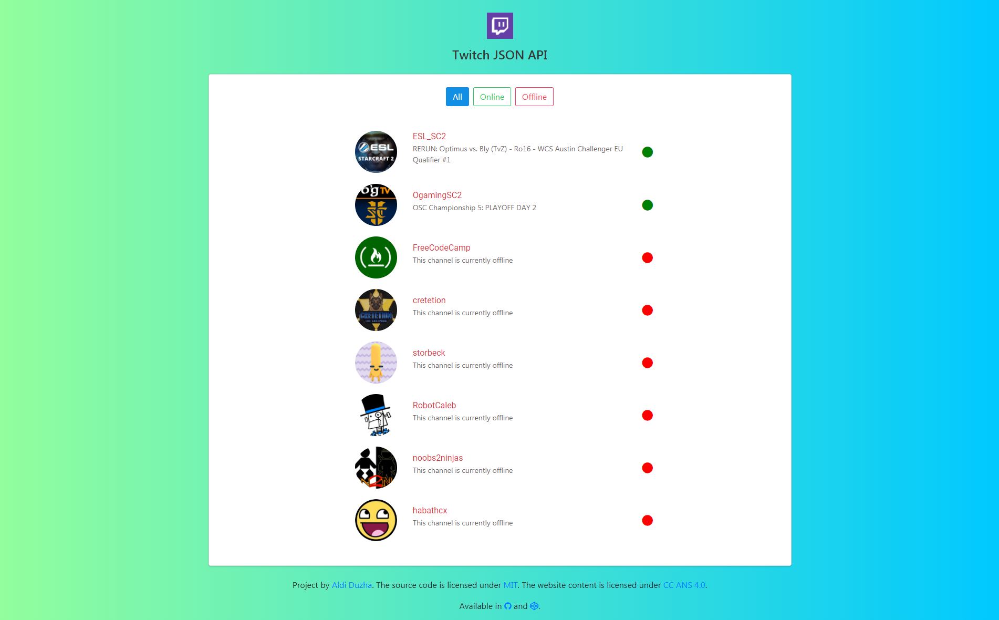

# Twitchtv JSON API
#### See online and offline users in Twitch

  

## Features:

- Awesome Interface thanks to Bulma Framework  
- Display online, offline and all users.  
- Easy to setup  
- Fast and lightweight.

## Main Page

## In order to change the channels, you have to edit the "channels" array in the script.js file.

## License

Licensed under [MIT](LICENSE) by [Aldi](https://aldiduzha.com).
